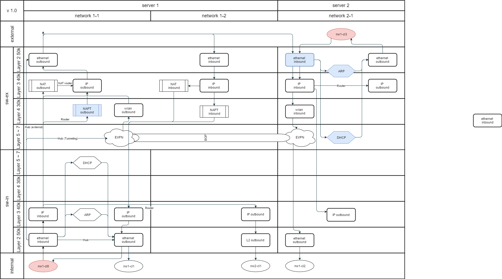

# mike

Mike is calico cat called in Japanese.

This component is debeloped for n0stack networking.
All packets are processed by OpenFlow with Ryu SDN.

## Flow Model



- Packets are started from red round node
- blue block means packetin

## architecture

```
REST API (django)
||
||
\/
+--------------------------------------+
Model (mike.lib.mike_object.MikeObject)
- mike.lib.objects
  - switch
  - port
    - host
    - link
- mike.services
+--------------------------------------+
/\                ||
|| Openflow       ||
\/                \/
Openflow switch / Open vSwitch
                  - internal
                  - external
```

## Author

- [@h-otter](https://github.com/h-otter)
